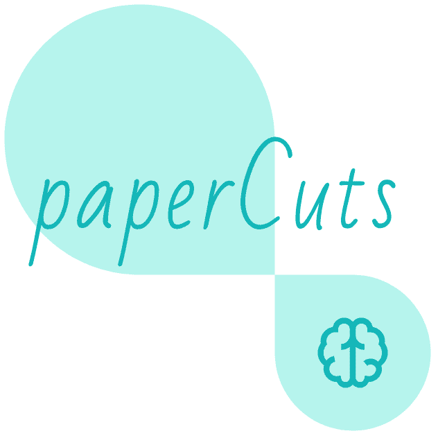

# [paperCuts][vercel-live]

<div style='text-align:center;'>
  <a href='https://papercuts.vercel.app/'>
    
  </a>
</div>

paperCuts is a site that lists free eBooks 📚 and online books related to programming, computer science, software engineering, web design and more which are provided by publishers or authors on their websites legally. We do not host pirated books or we do not link to sites that host pirated books.

for live demo

- [][vercel-live]
- [][netlify-live]

[vercel-live]: https://papercuts.vercel.app/
[netlify-live]: https://papercuts-project.netlify.app/

## Used tools

- [`Axios`](https://axios-http.com/)
- [`Bootstrap`](https://getbootstrap.com/)
- [`js-cookie`](https://www.npmjs.com/package/js-cookie)
- [`jwt-decode`](https://www.npmjs.com/package/jwt-decode)
- [`React-Dropzone`](https://react-dropzone.js.org)
- [`React-Icons`](https://react-icons.github.io/react-icons)
- [`React-Redux`](https://react-redux.js.org/)
- [`React-Router-Dom`](https://reactrouter.com/docs/en/v6/getting-started/tutorial)
- [`React.js`](https://reactjs.org/)
- [`Redux-Toolkit`](https://redux-toolkit.js.org/)
- [`sass`](https://sass-lang.com/)
- [`Validator`](https://www.npmjs.com/package/validator)

## Quick start 🚀

### First Step

Download the files from [`releases`](https://github.com/Mohammed-Taysser/paperCuts/releases) or clone it with **git** version control:

```shell
git clone https://github.com/Mohammed-Taysser/paperCuts.git
```

### Second Step

Inside paperCuts Directory Install Dependencies By

```shell
npm install
```

### Last Step

Start The Development Server

```shell
npm start
```

## Features 💬

- Designed with progressive enhancement in mind.
- Standalone With Only React
- Using Hooks & redux & cookies To Save And Deal With Data
- Use Redux with redux-toolkit Store

## Adding Bootstrap

```shell
npm install bootstrap
```

Import Bootstrap CSS and optionally Bootstrap theme CSS in the beginning of your `src/index.js` file:

```js
import 'bootstrap/dist/css/bootstrap.css';
// Put any other imports below so that CSS from your
// components takes precedence over default styles.
```

### Using a Custom Theme

To enable `scss` in Create React App you will need to install `sass`.

```shell
npm install sass
```

To customize Bootstrap, create a file called `src/custom.scss` (or similar) and import the Bootstrap source stylesheet. Add any overrides before the imported file(s). You can reference [Bootstrap's documentation](https://getbootstrap.com/docs/4.6/getting-started/theming/#variable-defaults) for the names of the available variables.

```scss
// Override default variables before the import
$body-bg: #000;

// Import Bootstrap and its default variables
@import '~bootstrap/scss/bootstrap.scss';
```

Finally, import the newly created `.scss` file instead of the default Bootstrap `.css` in the beginning of your `src/index.js` file, for example:

```js
import './custom.scss';
```

also create fake json using [`mockaroo`](https://mockaroo.com/)

for used public schemas see [`db.md`](docs/db.md) for more details and example.

for image url use [`picsum.photos`](https://picsum.photos/)

## Special Thanks For Inspiration To

- [`chapter-one-bookstore`](https://themeforest.net/item/chapterone-bookstore-and-publisher-theme/24715791)
- [`dbooks`](https://www.dbooks.org/)

## Additional Tips

### Create Tree Map

you can use `tree`

the `.` to use the current directory(don't forget to use it inside our project directory which call `paperCuts`)

[`TREE.md`](TREE.md) is the output file name

`-I "directory name"` use to exclude un-needed directory like `node_modules`

```shell
tree  . > TREE.md  -I "node_modules"
```
